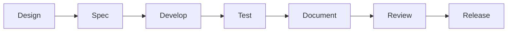

# 🗺️ CelestialUI-Vue Development Roadmap

## 🎯 Project Overview

CelestialUI-Vue is designed to be a comprehensive, maintainable, and scalable component library following atomic design principles with excellent developer experience.

## 📅 Development Phases

### Phase 1: Foundation & Core Components (Weeks 1-4)
**Goal**: Establish solid foundation with essential atomic components

#### Week 1: Infrastructure Setup
- [x] ✅ **Project Structure**: Optimize folder architecture
- [x] ✅ **Build System**: Configure Vite + TypeScript + DTS generation
- [x] ✅ **Testing Setup**: Configure Vitest, Cypress, Playwright
- [x] ✅ **Documentation**: Setup enhanced Storybook configuration
- [x] ✅ **CI/CD Pipeline**: GitHub Actions for testing and deployment

#### Week 2: Design System Foundation
- [ ] 🔄 **Design Tokens**: Create comprehensive token system
  - Colors, typography, spacing, shadows, borders
  - CSS custom properties generation
  - Theme variants (light, dark, high-contrast)
- [ ] 🔄 **Theme Engine**: Build runtime theme switching system
- [ ] 🔄 **CSS Architecture**: Base styles and utility classes
- [ ] 🔄 **Icon System**: SVG icon library with tree-shaking

#### Week 3: Core Atomic Components
- [ ] 🔄 **CButton**: All variants, sizes, states, icons
- [ ] 🔄 **CInput**: Text input with validation and styling
- [ ] 🔄 **CIcon**: SVG icon component with customization
- [ ] 🔄 **CBadge**: Status indicators and counts
- [ ] 🔄 **CAvatar**: User avatars with fallbacks
- [ ] 🔄 **CSpinner**: Loading indicators
- [ ] 🔄 **CDivider**: Visual separators

#### Week 4: Form Atoms & Testing
- [ ] 🔄 **CCheckbox**: Multi-state checkbox with indeterminate
- [ ] 🔄 **CRadio**: Radio button groups
- [ ] 🔄 **CSwitch**: Toggle switches
- [ ] 🔄 **CSlider**: Range sliders
- [ ] 🔄 **Unit Tests**: 90%+ coverage for all atoms
- [ ] 🔄 **Storybook**: Complete documentation for atoms

### Phase 2: Molecular Components (Weeks 5-8)
**Goal**: Build complex components combining atoms

#### Week 5: Form Molecules
- [ ] 🔄 **CFormField**: Complete form field with label, input, error
- [ ] 🔄 **CSelect**: Dropdown selection with search
- [ ] 🔄 **CMultiSelect**: Multiple selection component
- [ ] 🔄 **CTextarea**: Resizable text area
- [ ] 🔄 **CFileUpload**: File upload with drag & drop

#### Week 6: Advanced Form Components
- [ ] 🔄 **CDatePicker**: Date selection with calendar
- [ ] 🔄 **CTimePicker**: Time selection component
- [ ] 🔄 **CColorPicker**: Color selection tool
- [ ] 🔄 **CNumberInput**: Numeric input with controls
- [ ] 🔄 **CSearchInput**: Search with autocomplete
- [ ] 🔄 **CPasswordInput**: Password with visibility toggle

#### Week 7: Layout & Navigation Molecules
- [ ] 🔄 **CCard**: Content cards with headers/footers
- [ ] 🔄 **CTabs**: Tabbed content navigation
- [ ] 🔄 **CBreadcrumb**: Navigation breadcrumbs
- [ ] 🔄 **CPagination**: Page navigation component
- [ ] 🔄 **CMenu**: Dropdown and context menus

#### Week 8: Feedback & Overlay Molecules
- [ ] 🔄 **CModal**: Modal dialogs with accessibility
- [ ] 🔄 **CToast**: Toast notifications system
- [ ] 🔄 **CAlert**: Alert messages
- [ ] 🔄 **CPopover**: Contextual popovers
- [ ] 🔄 **CTooltip**: Hover tooltips
- [ ] 🔄 **Integration Tests**: Cross-component testing

### Phase 3: Organism Components (Weeks 9-12)
**Goal**: Build complex patterns and data components

#### Week 9: Data Display Organisms
- [ ] 🔄 **CTable**: Basic data table
- [ ] 🔄 **CDataTable**: Advanced table with sorting, filtering
- [ ] 🔄 **CVirtualTable**: Virtualized large datasets
- [ ] 🔄 **CList**: Flexible list component
- [ ] 🔄 **CInfiniteScroll**: Infinite scrolling lists

#### Week 10: Media & Layout Organisms
- [ ] 🔄 **CImage**: Responsive images with lazy loading
- [ ] 🔄 **CCarousel**: Image/content carousel
- [ ] 🔄 **CGallery**: Image gallery with lightbox
- [ ] 🔄 **CGrid**: Responsive grid system
- [ ] 🔄 **CFlex**: Flexible layout component

#### Week 11: Navigation & Structure Organisms
- [ ] 🔄 **CSidebar**: Collapsible sidebar navigation
- [ ] 🔄 **CHeader**: Application header
- [ ] 🔄 **CFooter**: Application footer
- [ ] 🔄 **CAppShell**: Complete app layout
- [ ] 🔄 **CNavigationRail**: Vertical navigation

#### Week 12: Advanced Form Organisms
- [ ] 🔄 **CFormWizard**: Multi-step forms
- [ ] 🔄 **CFormBuilder**: Dynamic form builder
- [ ] 🔄 **CAutocomplete**: Smart autocomplete
- [ ] 🔄 **CComboBox**: Searchable select
- [ ] 🔄 **E2E Tests**: Complete user journey testing

### Phase 4: Templates & Advanced Features (Weeks 13-16)
**Goal**: Complete layouts and advanced functionality

#### Week 13: Layout Templates
- [ ] 🔄 **CDashboardLayout**: Dashboard page template
- [ ] 🔄 **CAdminLayout**: Admin panel layout
- [ ] 🔄 **CAuthLayout**: Authentication pages
- [ ] 🔄 **CLandingLayout**: Marketing page layout
- [ ] 🔄 **CErrorLayout**: Error page templates

#### Week 14: Advanced Components
- [ ] 🔄 **CRichTextEditor**: WYSIWYG editor
- [ ] 🔄 **CCodeEditor**: Code editor with syntax highlighting
- [ ] 🔄 **CCalendar**: Calendar component
- [ ] 🔄 **CChart**: Chart visualization components
- [ ] 🔄 **CKanban**: Kanban board component

#### Week 15: Performance & Accessibility
- [ ] 🔄 **Performance Optimization**: Bundle analysis and optimization
- [ ] 🔄 **Accessibility Audit**: WCAG 2.1 AA compliance
- [ ] 🔄 **RTL Support**: Right-to-left language support
- [ ] 🔄 **Mobile Optimization**: Touch-friendly interactions
- [ ] 🔄 **Keyboard Navigation**: Complete keyboard support

#### Week 16: Documentation & Polish
- [ ] 🔄 **Documentation Site**: Complete documentation website
- [ ] 🔄 **Migration Guide**: Upgrade and migration docs
- [ ] 🔄 **Best Practices**: Usage guidelines and patterns
- [ ] 🔄 **Performance Guide**: Optimization recommendations
- [ ] 🔄 **Accessibility Guide**: A11y implementation guide

### Phase 5: Ecosystem & Extensions (Weeks 17-20)
**Goal**: Build ecosystem tools and framework integrations

#### Week 17: Framework Integrations
- [ ] 🔄 **Nuxt Module**: Official Nuxt.js integration
- [ ] 🔄 **Vite Plugin**: Development tools plugin
- [ ] 🔄 **ESLint Plugin**: Code quality rules
- [ ] 🔄 **VS Code Extension**: IntelliSense and snippets

#### Week 18: Developer Tools
- [ ] 🔄 **Design Tokens CLI**: Token generation tools
- [ ] 🔄 **Component Generator**: Component scaffolding
- [ ] 🔄 **Theme Builder**: Visual theme creation tool
- [ ] 🔄 **Figma Plugin**: Design-to-code integration

#### Week 19: Testing & Quality
- [ ] 🔄 **Visual Regression**: Chromatic integration
- [ ] 🔄 **Performance Monitoring**: Bundle size tracking
- [ ] 🔄 **Accessibility Testing**: Automated a11y testing
- [ ] 🔄 **Cross-browser Testing**: BrowserStack integration

#### Week 20: Release & Community
- [ ] 🔄 **v1.0 Release**: Stable public release
- [ ] 🔄 **Community Setup**: Discord, discussions, contributions
- [ ] 🔄 **Tutorial Series**: Video tutorials and guides
- [ ] 🔄 **Showcase Gallery**: Real-world usage examples

## 🏗️ Implementation Strategy

### 1. **Component Development Process**


#### For Each Component:
1. **Design Specification**
   - API design and props interface
   - Accessibility requirements
   - Visual states and variants
   - Usage patterns and examples

2. **Development**
   - Component implementation
   - TypeScript types
   - CSS styling with tokens
   - Composable logic extraction

3. **Testing**
   - Unit tests (behavior, props, events)
   - Integration tests (with other components)
   - Accessibility tests (a11y compliance)
   - Visual regression tests

4. **Documentation**
   - Storybook stories (all variants)
   - API documentation
   - Usage examples
   - Best practices guide

5. **Quality Assurance**
   - Code review process
   - Performance testing
   - Cross-browser compatibility
   - Mobile responsiveness

### 2. **Quality Gates**

#### Code Quality
- ✅ **TypeScript**: Strict mode, no `any` types
- ✅ **ESLint**: Vue.js + TypeScript rules
- ✅ **Prettier**: Consistent code formatting
- ✅ **Commitlint**: Conventional commit messages

#### Testing Requirements
- 🎯 **Unit Tests**: 90%+ line coverage
- 🎯 **Integration Tests**: 80%+ feature coverage
- 🎯 **E2E Tests**: 100% critical path coverage
- 🎯 **A11y Tests**: WCAG 2.1 AA compliance

#### Performance Standards
- 📊 **Bundle Size**: < 50KB gzipped per component category
- ⚡ **Render Time**: < 16ms per component (60fps)
- 🚀 **Tree Shaking**: 100% unused code elimination
- 📱 **Mobile**: Smooth interactions on low-end devices

#### Documentation Standards
- 📚 **Storybook**: Complete component documentation
- 🎨 **Design System**: Visual design guidelines
- 📖 **API Docs**: Auto-generated from TypeScript
- 🏃 **Quick Start**: 5-minute setup guide

### 3. **Release Strategy**

#### Versioning (Semantic Versioning)
- **Major**: Breaking changes
- **Minor**: New features, backward compatible
- **Patch**: Bug fixes, no API changes

#### Release Cycle
- 🚀 **Weekly**: Patch releases (bug fixes)
- 📅 **Bi-weekly**: Minor releases (new features)
- 🎯 **Quarterly**: Major releases (breaking changes)

#### Release Process
1. **Pre-release**: Alpha/beta testing
2. **Testing**: Comprehensive test suite
3. **Documentation**: Update guides and examples
4. **Changelog**: Detailed change documentation
5. **Migration**: Breaking change migration guides

## 📊 Success Metrics

### Adoption Metrics
- 📈 **Downloads**: NPM download statistics
- ⭐ **GitHub Stars**: Community interest indicator
- 💬 **Community**: Discord members, discussions
- 🐛 **Issues**: Bug reports and feature requests

### Quality Metrics
- ✅ **Test Coverage**: >90% across all test types
- 🔍 **Code Quality**: A+ CodeClimate rating
- ♿ **Accessibility**: 100% WCAG 2.1 AA compliance
- 📦 **Bundle Size**: <200KB full library gzipped

### Developer Experience
- ⚡ **Build Time**: <30s for full library build
- 🔧 **Setup Time**: <5min from install to first component
- 📚 **Documentation**: >95% API documentation coverage
- 🎯 **TypeScript**: 100% type coverage

### Performance Benchmarks
- 🚀 **First Paint**: <100ms component rendering
- 📱 **Mobile**: 60fps on mid-range devices
- 🌐 **Network**: <50KB initial load impact
- 💾 **Memory**: <10MB memory footprint

## 🛠️ Development Tools & Workflow

### Required Tools
- **Node.js**: v18+ (LTS)
- **Package Manager**: pnpm (preferred), npm, or yarn
- **IDE**: VS Code with Vue.js extensions
- **Browser**: Chrome DevTools for debugging

### Development Workflow
```bash
# Setup development environment
git clone https://github.com/dev-1603/CelestialUI-Vue.git
cd CelestialUI-Vue
pnpm install

# Start development server
pnpm dev

# Run tests
pnpm test:unit
pnpm test:e2e
pnpm test:coverage

# Build library
pnpm build:lib

# Start Storybook
pnpm storybook

# Release process
pnpm version:minor
pnpm release
```

### Git Workflow
- **Main Branch**: Stable, production-ready code
- **Develop Branch**: Integration branch for features
- **Feature Branches**: Individual feature development
- **Release Branches**: Preparation for releases
- **Hotfix Branches**: Critical bug fixes

### Code Review Process
1. **Feature Development**: Work in feature branch
2. **Pull Request**: Submit PR with description and tests
3. **Automated Checks**: CI/CD pipeline validation
4. **Peer Review**: Code review by team members
5. **Approval**: Merge after approval and passing tests

This roadmap provides a comprehensive plan for building a world-class Vue.js component library with excellent developer experience, maintainability, and scalability.
